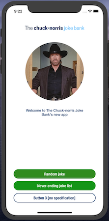
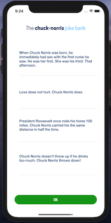

# Chuck Norris Joke Bank App

## This is my 'Tech-Challenge' set by The Co-Operative Bank (goto bottom for the brief)

## IMPORTANT

**Download and research the Co-op Bank iOS App and make notes about the UI.**

**MAKE SURE YOUR MACHINES XCODE IS UPTO DATE!!!!!!!!**

### Let's Begin
1. Create a new XCode Project (Single View App)
2. Give it a Name and User Interface of Storyboard (All tick boxes should be empty)
3. Deployment Info should be set to the latest version
4. Device's should be set to iPhone & iPad
5. Orientation should be set to Portrait only (As this seems to match Co-op Banks App)

6. Find your favorite 'Chuck Norris' image from google search and save it. [Assumed knowledge of Google]

### Create Your Images
**Use Canva.com to create the following images [Assumed knowledge of this site]**
1. An App Icon
2. Mission Statement [When App is loading]
2. Business Logo [To appear on all View Controllers]
3. An Opened Lock
4. A pair of Nun-'chucks'
5. A bruised up bad guy

**Use appicon.io to create your images [Assumed knowledge of this site]**
6. Add the created images to your Assets.xcassets within your project

### Set-up
#### LaunchScreen.storyboard
1. Add an image Object and position to suit your design
2. Set image in Attributes Inspector to 'Mission Statement'

#### Create the MVC layout
**Add 3 new Groups (File > New > Group)**
1. Model
2. View
3. Controller
4. Move *.storyboard to View Group
5. Move *.ViewController to Controller Group

#### Create 2 new [UIViewController SubClass] files in the Controller Group (File > New > File > Coca Touch Class)
1. SingleJokeViewController.swift
2. JokeListViewController.swift

#### Add 2 new ViewController Objects to your Main.storyboard
1. Give one a class (within Identity Inspector) of SingleJokeViewController
2. Give the other a class of JokeListViewController
*(This now links your code to the 'Assistant' when viewing through Main.storybord)*

#### Create Segues
1. From View Controller Scene - Click on the ViewController icon [yellow symbol]
2. Hold 'Control Button' and drag the blue line to one of the new view controllers created.

3. Repeat this and drag to the other newly created view controller.
4. Click on the 1st Segue arrow and from within the attributes inspector give the identifier the name 'goToSingle' (Present Modally)
5. Click on the 2nd Segue arrow and from within the attributes inspector give the identifier the name 'goToList' (Present Modally)

#### Main.storyboard
>##### Add Objects
>**SingleJokeViewController** - Will already appear over the first screen (ViewController) with part of the first screen still showing
>
>**JokeListViewController** - We need to make this appear as a pop-up message... 
>1. Within the View Controller Attributes Inspector set 'Transition Style' to 'Flip Horizontal' and set 'Presentation' to 'Full Screen'
>
>**ViewController** - Add: 2 image Objects, 1 label Object and 3 button Objects
>
>**SingleJokeViewController** - Add: 4 image Objects, 1 label Object and 1 button Object
>
>**JokeListViewController** - Add: 1 image Object, 1 tableView Object (Add 1 prototype cell with 'identifier "Cell") and 1 button Object
>
>**JokeListViewController** TableView - Add: 1 label Object to the prototype cell and format the text to suit your design [refer to Co-op Bank App research]
>
>*NB: When adding the Label Object to the Table Cell, Make sure to set constraints to bounds! or you could waste alot of time wondering why no data is displayed!*
>
1. Position objects to suit your design [refer to Co-op Bank App research]
2. Add the IBOutlets to corresponding ViewController file
3. Add IBActions to corresponding ViewController file
4. Set images in Attributes Inspectors to relevant images you created

**Create a new UITableViewCell file in the View Group (File > New > File > Coca Touch Class)**
1. JokeCell - Used to format the text of the joke retrieved for displaying in our table

**Create 2 new Swift Files in your 'Model' group (File > New > File > Swift File)**
1. RandomJokeManagerJokeDelegate - Used to fetch a random joke from the API
2. RandomJokeData - Structure Data

#### MODEL: RandomJokeManagerDelegate
1. Set protocol and functions we require to pass the data back to SingleJokeViewController or JokeListViewController
2. Provide API address that we will use to fetch a random joke
3. Perform a request to get hold of that random joke
4. Decode the JSON Data ready to pass back

#### MODEL: RandomJokeData
1. Set struct format that will hold the joke returned from RandomJokeManagerDelegate

#### CONTROLLER: ViewController.swift
1. Edit the appearance of your IBOutlets to match your design [refer to Co-op Bank App research]
2. In your 'Button 1' IBActions enter 'perform segue to your 'goToSingle'
```swift
@IBAction func randomJokeButtonPressed(_ sender: UIButton) {
    self.performSegue(withIdentifier: "goToSingle", sender: self)
}
```
3. In your 'Button 2' IBActions enter perform segue to your 'goToList' identifier
```swift
@IBAction func jokeListButtonPressed(_ sender: UIButton) {
    self.performSegue(withIdentifier: "goToList", sender: self)
}
```
4. Button 3 has no specification and so does not require an action.
5. You will now be sent to the designated ViewController when the button is pressed

*You now have a 'Starting' view that provides links to 2 other views via the buttons coded with Segue's in steps 2 & 3*

#### CONTROLLER: SingleJokeViewController.swift
1. Edit the appearance of your IBOutlets to match your design [refer to Co-op Bank App research]
2. Add the dismiss code to your buttons IBAction
```swift
@IBAction func okButtonPressed(_ sender: UIButton) {
    self.dismiss(animated: true, completion: nil)
}
```
3. Add RandomJokeManagerDelegate to your class
```swift
class SingleJokeViewController: UIViewController, RandomJokeManagerDelegate {
```
4. Set RandomJokeManagerDelegate to .self in 'viewDidLoad'
5. Call the function to retrieve a random joke from the API (fetchRandomJoke)
6. Display the data returned to the UILabel on screen if valid data was returned from the function created in the RandomJokeManagerDelegate Protocol

#### CONTROLLER: JokeListViewController.swift
1. Edit the appearance of your IBOutlets to match your design [refer to Co-op Bank App research]
2. Add the dismiss code to your buttons IBAction
```swift
@IBAction func okButtonPressed(_ sender: UIButton) {
    self.dismiss(animated: true, completion: nil)
}
```
3. Set the Table View's Prototype cell class to JokeCell (UITableViewCell created earlier)
4. You will now be able to Control + Drag the Label Object from Main.storyboard to JokeCell.swift to create an IBOutlet

**VIEW: JokeCell.swift**

5. Create a function that will be passed a joke in string format 'func myFunc (randomJoke: String)'
6. Set the IBOutlet UILabel text to the joke received (ie. randomJoke)

**CONTROLLER: JokeListViewController.swift**

7. Add RandomJokeManagerDelegate, UITableViewDelegate & UITableViewDataSource to your class
```swift
class JokeListViewController: UIViewController, UITableViewDelegate, 
            UITableViewDataSource, RandomJokeManagerDelegate {
```
8. Set RandomJokeManager & TableView delegates equal to .self in 'viewDidLoad'
9. Create a loop that we can use to call and retrieve 'x' amount of jokes each time its requested
10. In ViewDidLoad - Call the function to retrieve a random joke from the API (fetchRandomJoke) for the number set in our loop
11. Create a ViewDidAppear and reload() the table view so the fetched jokes appear when the screen loads
12. Add a numberOfRowsInSection & cellForRowAt so out UITable will work
13. Create an empty array to hold the retrieved random jokes
```swift
var randomJokeArray = [String]()
```
14. numberOfRowsInSection needs to be equal to the array we created .count
15. cellForRowAt now needs to populate the JokeCell we created earlier with the array[indexPath.row] in order to display all jokes held in our array
16. In order to make the table scroll infinitely we need to introduce scrollViewDidScroll to calculate when we have reached the bottom of the table
17. Once we have confirmed the user has reached the bottom of the page we can call for the app to fetch another batch of jokes from the function we created earlier and the table reloaded with the new data
18. I have set a 1 second delay so the spinner function will be seen by the user

#### SPINNER FUNCTION IS COMMENTED OUT AS ONLY WORKS ONCE THEN CRASHES - WORKING ON A FIX.
> If you would like to see the spinner in action you need to un-comment the 7 areas of code between *** SPINNER FUNCTION ERROR [1-7]

```swift
// *** SPINNER FUNCTION ERROR [1]
//        let loadingNib = UINib(nibName: "LoadingCell", bundle: nil)
//        jokeTableView.register(loadingNib, forCellReuseIdentifier: "LoadingCell")
// *** SPINNER FUNCTION ERROR [1]
```

### SET CONSTRAINTS & TEST ON DEVICES...

### ADD UNIT TESTS
1. Within your project (under TARGETS) add 'Unit Testing Bundle'
2. Enter your tests within the swift file created.

### Screenshots





#### Example of text truncation for larger jokes


# Brief

## iOS Swift Programming Challenge - Junior
### Functional requirements
Create a simple iOS app that interacts with the Internet Chuck Norris Database API [http://www.icndb.com/api/​](http://www.icndb.com/api/​)

The Challenge consists of three tasks, each has a button on the home screen:

## 1) Random Joke
When the ‘Random Joke’ button is pressed, the app fetches one random joke from the Chuck Norris server and displays the random joke in a popup with an OK button.

Use the following end point
[http://api.icndb.com/jokes/random?exclude=[explicit​]](http://api.icndb.com/jokes/random?exclude=[explicit​])

## 2) Never-ending Joke list
When the ‘Never-ending Jokes’ button is pressed, the app opens a new view that contains a list of random jokes. Jokes should be requested asynchronously, in batches from the server. When the user scrolls to the bottom of the list, the list shows a loading message indicating that more jokes are being fetched.

Since the jokes are random, it is fine in this simple task to have duplicate jokes in the list. 

Use the following end point
[http://api.icndb.com/jokes/random?exclude=[explicit​]](http://api.icndb.com/jokes/random?exclude=[explicit​])

## Technical requirements
   
The application should be written entirely in Swift 4.x+ and able to run on any iPhone running iOS 10.0 or greater.

The app layer should support iPhone (required) and iPad (nice to have, but not required).

## Evaluation criteria

* The solution should be of high quality, suitable for production. This means that it should be stable, account for edge cases, unhappy scenarios and be responsive and fluid. Make sure you are paying attention to detailIf you are unsure about anything, use your own judgment to create the best solution. This is just a test to show your approach to problem solving, design and software development

* We would like to see business logic covered by ​Unit tests.

    Use any testable architecture (eg, MVVM, MVVM+C Viper or clean architecture) however, we required you to rely solely on the native XCTest framework (no external libraries are allowed for unit tests)

* Your code should demonstrate best-practices both from an iOS and a general software development perspective.

* For design/UI, you can use the Coop application as a reference. .

## Deliverables

The completed project can be delivered as a zipped file or in a GitHub repository. A readme file should be included detailing how to simply build the app.
